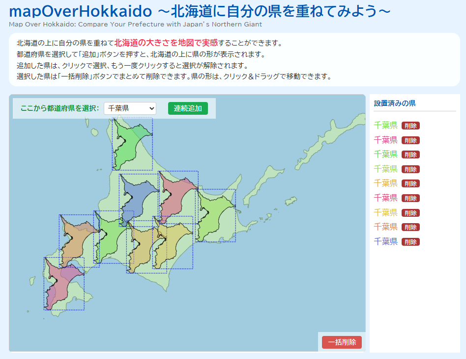

# mapOverHokkaido ～北海道に自分の県を重ねてみよう～
＊本リポジトリは公開専用です。Pull Request や Issue の受付は行っていません。

- こんにちは、道産子のlumiere41です。
「mapOverHokkaido」は、北海道の地図の上に自分の県を重ねて、
北海道の大きさを直感的に比較できるブラウザアプリケーションです。



- こちらのサイトの北海道対他県比較版のようなものです。
参考出展：  [『The True Size Of …』](https://thetruesize.com/#?borders=1~!MTUwODI3NzA.MjU4OTMxNg*MzIwMTQxMTY(NzM4NzE2Mw~!CONTIGUOUS_US*MTAwMjQwNzU.MjUwMjM1MTc(MTc1)MQ~!IN*NTI2NDA1MQ.Nzg2MzQyMQ)Mg~!CN*OTkyMTY5Nw.NzMxNDcwNQ(MjI1)Mw)

- 元データは [国土数値情報（国土交通省）](https://nlftp.mlit.go.jp/ksj/) を利用しています。

- [X（旧Twitter）でよく話題](https://x.com/kitazatosatuki/status/1956343008640856215)になる北海道の大きさを実感できない北海道民以外の方に向けて、地図で比較できるアプリを作ってみたいなと思い、chatGPT君と相談しながら作ってみました。

---
## デモURL

👉 [GitHub Pages 公開版](https://lumiere41.github.io/mapOverHokkaido/)

---

## 利用方法

1. 画面上部のプルダウンから都道府県を選択
2. 「連続追加」ボタンで北海道の上に表示
3. 表示された県は **クリックで選択／再クリックで解除** できます。
4. 県はドラッグで移動可能
5. 「一括削除」ボタンでまとめて削除

---

## 技術スタック

* HTML / CSS / JavaScript (Vanilla JS)
* [D3.js v7](https://d3js.org/)
* GeoJSON データ（日本の行政区域）

---

## ライセンス

このリポジトリのコードおよび生成物は **[CC BY-NC 4.0](https://creativecommons.org/licenses/by-nc/4.0/deed.ja)** に従います。 

### わかりやすい利用ルール（要約）
- 個人の勉強や趣味の範囲での利用・改変は自由です。  
- 研究・教育・非営利のイベントなどでも自由に使えます。  
- 出典（© 2025 lumiere41、データ出典元）を明記してください。  
- **商用利用（広告・営利サービス・書籍・メディア番組・ネット動画など）は原則禁止です。**  
- 大きな改変を加えた上での公開は自由ですが、単純に色や名前を変えただけの再公開はご遠慮ください。  

※ 法的な詳細は [LICENSE](./LICENSE) を参照してください。


### データ
- 本アプリで使用している地図データは  
[dataofjapan/land](https://github.com/dataofjapan/land) に公開されている日本の行政区域 GeoJSON を元に、都道府県ごとに分割したものです。  
- 元データは [国土数値情報（国土交通省）](https://nlftp.mlit.go.jp/ksj/) を利用しています。  
- データライセンスは [CC BY 4.0](https://creativecommons.org/licenses/by/4.0/deed.ja) に従います。

---

## 開発者向け情報

### ローカルでの実行方法

```bash
git clone https://github.com/lumiere41/mapOverHokkaido.git
cd mapOverHokkaido
# ブラウザで index.html を開くだけで動作します
```

### フォルダ構成

```
index.html          # メインページ
app.js              # D3.js を用いた描画処理
index.css           # スタイル
geojsons/           # 都道府県ごとの GeoJSON データ
split_prefectures_short.py  # 全国データを分割するスクリプト（公開不要なら除外可）
```

---

## 注意事項

* 個人情報や機密データは含まれていません。
* 教育・学習・デモ・お遊び用途を想定しています。
* 公開時には **GitHub Pages のキャッシュ** が残る場合があるため、更新直後は Shift+Reload を推奨します。

---

## 今後の展望
- 画像ダウンロード機能の実装
- 北海道以南の地図上に北海道をかぶせて表示できる全国地図版の作成
- スマホ用の最適化

## 作者

* 作成者: lumiere41
[Ｘのアカウント](https://x.com/lumDesign00)